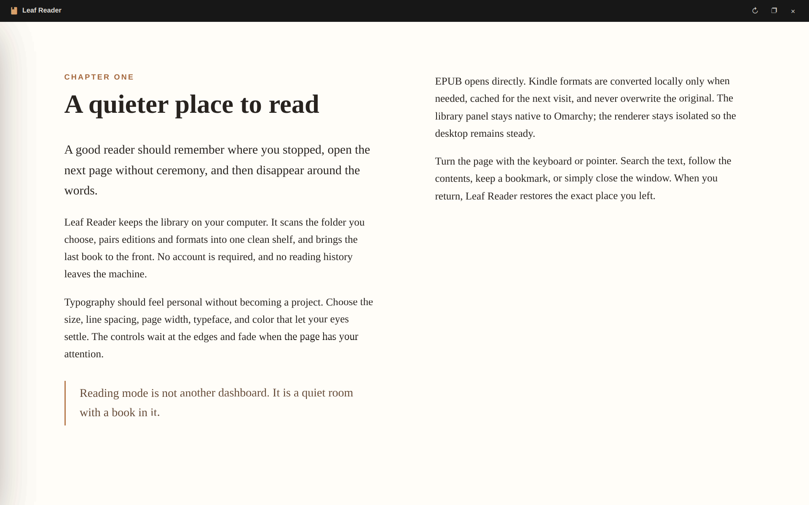
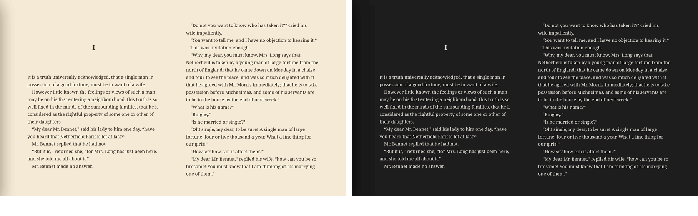

# Leaf Reader for Omarchy

Leaf Reader turns the Omarchy bar into a calm, local-first ebook library. Click the book icon to browse your covers; right-click it to jump straight back into the last book and exact location you were reading.


_The native Omarchy dropdown keeps your local library, current book, search, and reader settings one click away._



_Reading mode opens as a quiet two-page spread with controls that disappear until you deliberately call them back._

The library panel is compact and native to the Omarchy shell. Reading opens in a separate native Qt window designed to disappear around the page: quiet typography, restrained controls, no accounts, no cloud, and no library management ceremony. The separate process keeps the shell isolated from the comparatively heavy WebEngine renderer.

## Reading appearance



_Sepia for a warmer page, and Night dark mode for comfortable low-light reading._

Choose Paper, Sepia, Slate, or Night dark mode, then fine-tune the text size, serif/sans/publisher typeface, line spacing, page width, and paginated or scrolling layout. The realistic page-turn effect can be switched off for an instant, motion-free page change, and every choice is remembered.

## What it does

- Remembers the last book, exact EPUB location, percentage, chapter, and bookmarks
- Loads the last-read book first and keeps a prominent **Continue reading** card
- Includes four polished public-domain classics for a ready-to-read offline starter shelf
- Recursively scans any folder you choose
- Groups multiple formats of the same book into one library entry
- Reads EPUB directly, with covers and metadata extracted locally
- Reads PDF through Qt WebEngine's built-in viewer
- Supports AZW3, MOBI, AZW, PRC, FB2, FBZ, HTMLZ, RTF, TXT, and TXTZ when the optional `ebook-convert` command is available
- Includes title/author search, table of contents, in-book search, bookmarks, progress scrubbing, and keyboard navigation
- Provides text size, serif/sans/publisher fonts, line spacing, per-page width, page/scroll layouts, and Paper, Sepia, Slate, and Night themes
- Adds a realistic page-turn effect across the two-page spread, with an off switch and automatic reduced-motion fallback
- Keeps page turns distraction-free: navigation never wakes the reader controls
- Stores state under XDG state/cache folders and never uploads book data

## Install

```bash
omarchy plugin add https://github.com/dlpwaters/omarchy-ebook-reader.git --enable
```

Leaf Reader needs `qt6-declarative`, `qt6-webengine`, `python`, `zenity`, and `noto-fonts`. These are already present on a standard current Omarchy installation. EPUB and PDF work without Calibre.

On first use, Leaf Reader opens its bundled starter shelf unless `~/Books` already contains ebooks. Choose any other default folder from Reader settings; it is scanned recursively and becomes your library.

Kindle and other conversion-only formats require the optional `calibre` package, which provides `ebook-convert`. Calibre is never used for EPUB/PDF reading or library management.

The starter editions are unmodified Standard Ebooks files. Their exact sources, checksums, and public-domain/CC0 terms are recorded in [STARTER_BOOKS.md](STARTER_BOOKS.md).

## Remove

```bash
omarchy plugin remove io.github.dlpwaters.ebook-reader
```

Your books are never touched. Omarchy removes the plugin checkout; Leaf Reader's settings, progress, and cache remain in the XDG locations below so reinstalling can restore your place.

## Use

- Left-click the bar icon: open the library
- Right-click the bar icon: resume the last book
- Click a cover: read it
- `←` / `→`, `Page Up` / `Page Down`, or `Space`: turn pages
- `/`: search the current book
- `T`: table of contents
- `B`: add or remove a bookmark
- `A`: reading appearance
- `L`: library
- `Esc`: show or hide the reader controls, or close an open drawer
- `Ctrl+Shift+Q`: close the reading window

Reader controls fade away while you read and return on pointer movement, a click/tap in the reading area, or `Esc`. Keyboard and edge-click page turns do not make them flash back on.

## Formats

| Format | How it opens |
| --- | --- |
| EPUB | Directly in the bundled offline EPUB engine |
| PDF | Directly in Qt WebEngine |
| AZW3, MOBI, AZW, PRC | Converted locally to a cached EPUB on first open |
| FB2, FBZ, HTMLZ, RTF, TXT, TXTZ | Converted locally to a cached EPUB on first open |

If a book folder contains EPUB plus another format, Leaf Reader always prefers the EPUB and does not convert anything. DRM-protected ebooks cannot be opened or converted.

## Privacy and storage

Nothing is sent over the network. The helper binds only to a dynamically selected `127.0.0.1` port, uses a per-process request token for writes, and serves only known books and bundled reader assets. The reader uses an off-the-record WebEngine profile and disables outbound networking for book content.

- Settings: `$XDG_STATE_HOME/omarchy-ebook-reader/settings.json`
- Reading progress and bookmarks: `$XDG_STATE_HOME/omarchy-ebook-reader/progress.json`
- Metadata, cover, and conversion cache: `$XDG_CACHE_HOME/omarchy-ebook-reader/`

Your original books are never modified.

## Verify a checkout

```bash
python3 -m unittest discover -s tests -v
python3 -m py_compile ebook-tool
node --check web/app.js
qmllint -I /usr/share/omarchy/shell BarWidget.qml Panel.qml
qmllint ReaderApp.qml
omarchy plugin validate .
./ebook-tool doctor
```

## Troubleshooting

Run `./ebook-tool doctor` inside the plugin folder. It reports the selected library, scanned book count, EPUB renderer, Qt WebEngine, and optional converter status.

If a folder was moved, choose it again in Reader settings. If covers or metadata changed, use the rescan button in the panel. A first open of a large AZW3/MOBI book may take a moment because the conversion is done locally and cached for later opens.

## License

Leaf Reader's software is MIT licensed. Bundled dependency licenses are documented in [THIRD_PARTY_NOTICES.md](THIRD_PARTY_NOTICES.md); starter-book provenance and separate public-domain/CC0 terms are in [STARTER_BOOKS.md](STARTER_BOOKS.md).
